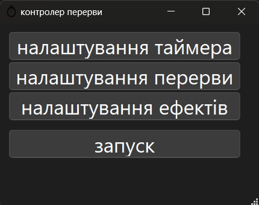
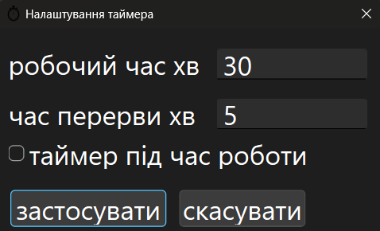
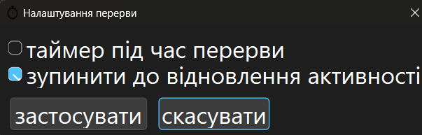
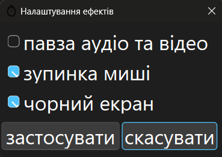
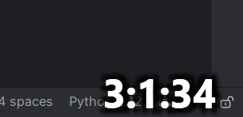

# Контролер перерв

# Зміст
1. [Проблема](#Проблема)
2. [Встановлення](#Встановлення)
3. [Опис](#Опис)

# Проблема

Багато людей, а особливо програмістів, дуже довго сидять за комп'ютером без перерв, 
що сильно шкодить здоров'ю. За рекомендаціями лікарів, потрібно кожні 20-40 хв робити перерву 
і хоча б хвилину відпочити.

Дана програма призначена для створення перерв.
Коли проходить зазначений час, встановлений в налаштуваннях, програма блокує можливість
працювати за комп'ютером на певний час, після чого дозволяє продовжити роботу.

В налаштування можна вказати час роботи, час перерви, які ефекти діятимуть під час перерви 
для блокування роботи. Також є можливість поставити таймер.

[Зміст](#зміст)
# Встановлення

### Для користувачів

Готова програма знаходиться за посиланням, скачавши можна відразу її використовувати.

[Break Controller](https://github.com/DemaReaktor/alarmer/releases/download/v1.1.1/main.exe)

[Зміст](#зміст)
### Для розробників

Для роботи з проєктом достатньо мати python на пк. 

Склонувавши проєкт, в терміналі потрібно ввести команду для встановлення усіх пакетів:

```commandline
pip install -r requirements.txt
```

Головний скрипт знаходиться в `app/main.py` . Для запуску скрипта достатньо прописати 
в терміналі (звісно термінал має знаходитись в папці проєкту):
```commandline
python -m app.main 
```

Щоб збудувати з проєкту програму, потрібно в терміналі ввести команду:
```commandline
pyinstaller.exe --onefile --add-data="app/presentation/ui/*;app/presentation/ui/."  
--add-data="app/presentation/images/*;app/presentation/images/." --windowed app/main.py
```

Готова програма знаходиться в папці `dist/`.

[Зміст](#зміст)

# Опис

Програма є фоновою, при запуску вона буде відображатись у фонових програмах.
Нажавши на іконку, відкриється програма.



Остання кнопка запускає контролер, остальні відкривають спеціальні налаштування.

### Налаштування таймера

Перші 2 поля визначають час для роботи і перерви (у хв, з допомогою . або , можна вказати більш точний час). 
Пункт "таймер під час роботи" визначає, чи буде відображатись таймер під час роботи.



### Налаштування перерви

"Таймер під час перерви" визначає, чи буде видно таймер під час перерви.
Якщо "Зупинити до відновлення активності" буде вимкнено, після закінчення 
перерви всі ефекти зникнуть і відразу почнеться відлік часу роботи, якщо буде
увімкнуто, то відлік розпочнеться лише коли користувач наведе мишку на текст.



### Налаштування ефектів

Ефекти у цій програмі допомагають блокування комп'ютера під час перерви.
Павза медіа дозволяє зупинити відео чи музику коли починається перерва.

> [!NOTE] 
> Якщо цей пункт увімкнений а музика зупинена, то вона навпаки увімкнеться!

Зупинка миші призначення для зупинки миші, аби не було можливості вимкнути перерву.
Чрний екран робить чорний екран, що не дозволяє бачити нічого за пк. 



### Таймер

Таймер відображатиметься в крайньому правому кутку.



[Зміст](#зміст)